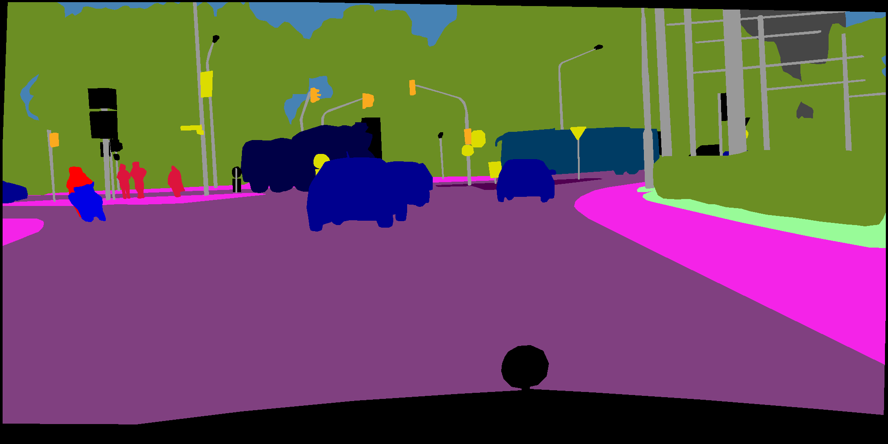

## Introduce

Segmentation is what you need. Support deeplapv3 plus now.



## Model zoo

|Model|Backbone|Datasets|eval size|Mean IoU(paper)|Mean IoU(this repo)|
|:-:|:-:|:-:|:-:|:-:|:-:|
|DeepLabv3_plus|xception65|cityscape(val)|(1025,2049)|78.8|[78.93](https://github.com/LikeLy-Journey/SegmenTron/releases/download/v0.1.0/deeplabv3_plus_xception_segmentron.pth)|
|DeepLabv3_plus|resnet101|cityscape(val)|(1025,2049)|-|[78.27](https://github.com/LikeLy-Journey/SegmenTron/releases/download/v0.1.0/deeplabv3_plus_resnet101_segmentron.pth)|
|Danet|resnet101|cityscape(val)|(1024,2048)|79.9|[79.34](https://github.com/LikeLy-Journey/SegmenTron/releases/download/v0.1.0/danet101_segmentron.pth)|
|Pspnet|resnet101|cityscape(val)|(1025,2049)|78.63|[77.00](https://github.com/LikeLy-Journey/SegmenTron/releases/download/v0.1.0/pspnet_resnet101_segmentron.pth)|

### real-time models
Model|Backbone|Datasets|eval size|Mean IoU(paper)|Mean IoU(this repo)|FPS|
|:-:|:-:|:-:|:-:|:-:|:-:|:-:|
|ICnet|resnet50(0.5)|cityscape(val)|(1024,2048)|67.8|-|41.39|
|DeepLabv3_plus|mobilenetV2|cityscape(val)|(1024,2048)|70.5|-|46.64|
|DFANet|xceptionA|cityscape(val)|(1024,2048)|70.3|-|21.46|
|HRNet|w18_small_v1|cityscape(val)|(1024,2048)|70.3|[70.5](https://github.com/LikeLy-Journey/SegmenTron/releases/download/v0.1.0/hrnet_w18_small_v1_segmentron.pth)|66.01|
|Fast_SCNN|-|cityscape(val)|(1024,2048)|68.3|[67.3](https://github.com/LikeLy-Journey/SegmenTron/releases/download/v0.1.0/fast_scnn_segmentron.pth)|145.77|

FPS was tested on V100.

## Environments

- OS: Ubuntu16.04
- python 3.7.4
- torch >= 1.1.0
- torchvision
- pyyaml
- Pillow
- numpy


## Dataset prepare

Goto [Cityscape](https://www.cityscapes-dataset.com) register a account and download datasets.
put cityscape data as follow:
```
datasets/cityscapes/
|-- gtFine
|   |-- test
|   |-- train
|   `-- val
|-- leftImg8bit
    |-- test
    |-- train
    `-- val
```

## Pretrained backbone models 

pretrained backbone models will be download automatically in pytorch default directory(```~/.cache/torch/checkpoints/```).

## Code structure
```
├── configs    # yaml config file
├── segmentron # core code
├── tools      # train eval code
└── datasets   # put datasets here 
```

## Train
cd tools
```
export NGPUS=4
export CUDA_VISIBLE_DEVICES=0,1,2,3 
python -m torch.distributed.launch --nproc_per_node=$NGPUS train.py \
          ../configs/cityscapes_deeplabv3_plus.yaml
```

## Eval
Download trained model from model zoo table above, and put it in ```SegmenTron/trained_models/```
modify config yaml for corresponding model path:
```
TEST:
    TEST_MODEL_PATH: your_test_model_path
```
```
export NGPUS=4
export CUDA_VISIBLE_DEVICES=0,1,2,3 
python -m torch.distributed.launch --nproc_per_node=$NGPUS eval.py \
          ../configs/cityscapes_deeplabv3_plus.yaml
```

## References
- [PyTorch-Encoding](https://github.com/zhanghang1989/PyTorch-Encoding)
- [detectron2](https://github.com/facebookresearch/detectron2)
- [gloun-cv](https://github.com/dmlc/gluon-cv)